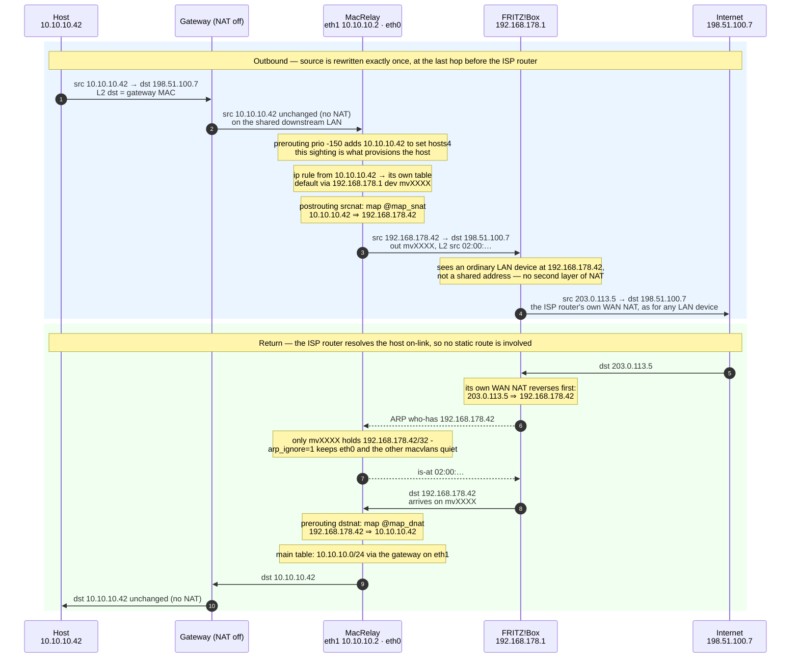
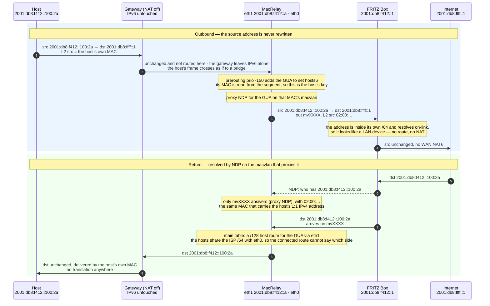

# MacRelay

**MacRelay** runs on an OpenWrt box sitting between an ISP router (e.g. a FRITZ!Box) and a downstream router. Instead of forwarding all downstream traffic behind one shared address, it dynamically provisions a dedicated macvlan interface per host it sees, giving each host true 1:1 NAT on IPv4 and, for IPv6 passthrough, its own identity on the upstream LAN — same MAC for both families. Idle hosts are automatically torn down.

## How it works

```
                 ┌──────────────┐        ┌────────────────────┐        ┌──────────────┐
  Internet ──────┤  FRITZ!Box   ├── eth0 ┤      MacRelay      ├ eth1 ──┤   Gateway    ├── clients
                 │ 192.168.178. │ macvlan│   (OpenWrt box)    │        │  (NAT off)   │
                 └──────────────┘ mvXXXX └────────────────────┘        └──────────────┘
```

1. Hosts are discovered two ways, because the two families arrive differently:
   - **IPv4** is routed (and usually NATed) by the downstream router, so only its
     source addresses are visible. An nftables dynamic set records the source address
     of everything in `INT_PREFIX4` forwarded through `INT_IF`; the host's MAC never
     reaches this box, so such a host is keyed by its address (`ip-…`).
   - **IPv6** is passthrough: the hosts keep the FRITZ!Box `/64` and their own frames
     reach `INT_IF`, so a second dynamic set records the GUAs on the segment. A host
     is keyed by the **MAC that answers NDP for its GUAs**.
2. Each host gets a macvlan interface (`mvXXXX`, mode `bridge`) on the upstream interface
   with a deterministic locally-administered MAC (`02:00:...`).
3. A per-host routing table ID is derived from the host key (collision-checked) and the
   host's traffic is steered into it with an `ip rule`.
4. **IPv4:** the host's internal address `10.10.10.X` is mapped 1:1 onto `192.168.178.X`
   via nftables `map_snat` / `map_dnat` maps, so the FRITZ!Box sees each host as its own
   LAN device.
5. **IPv6:** nothing is translated. The host's GUA is published on the upstream LAN with
   **proxy NDP on its own macvlan**, so from the FRITZ!Box the host looks like an ordinary
   LAN device that answers on its own MAC. No route for the host prefix is needed anywhere.
6. A garbage collector tears down interfaces, rules, routes and NAT entries once a host
   goes idle (no conntrack flows) and is no longer present.

### One MAC per host, for both families

The FRITZ!Box's client list, parental controls and similar features treat each MAC as one
device, so it matters that a host's `192.168.178.X` and its GUA are answered by the same
MAC. The two discovery paths — IPv4 keyed by source address, IPv6 keyed by the MAC that
answers NDP — are joined before either one provisions anything:

- Whichever family arrives first establishes the host's identity; the other reuses it
  rather than creating a second interface. The lookup works in both orders, because the
  GUA and the 1:1 address identify each other: `gua_v4` reads a GUA as identifying
  `10.10.10.N` either when its low 32 bits are the address verbatim (`::10.10.10.42`) or
  when its last hextet is the hex of the host octet (`…::2a` → `.42` — what the lab
  simulates, and the convention a router creates when it derives interface IDs from the
  IPv4 host part). `gua6_of` is the same rule read backwards, used to ask which MAC
  answers for a host whose IPv4 was seen first.
- With `UNIFY_MAC=1` (the default) the two families therefore land on one macvlan and
  one MAC without any state being rewritten. Set it to `0` to key them independently;
  set `PROVISION_IPV6=0` where a delegated prefix is routed to this box and plain
  routing already covers it.

### A packet, end to end

Outbound, a host's IPv4 traffic is rewritten exactly once, at the last hop before the
ISP router, while its IPv6 traffic is never rewritten at all. Return traffic reverses
each path: the IPv4 address is resolved by ARP on the macvlan that holds the 1:1 mapping,
the GUA by NDP on the macvlan that proxies it — the same interface, and so the same MAC.

`10.10.10.42` / `2001:db8:f412::100:2a` is one host. The gateway routes its IPv4
through itself (router-on-a-stick); its IPv6 is passthrough and is not seen by the gateway
at all.

#### IPv4 — 1:1 NAT on the last hop



#### IPv6 — passthrough, proxied on the host's own macvlan

The host keeps the FRITZ!Box `/64`. Nothing is translated and nothing is routed on its
behalf: MacRelay answers NDP for the GUA on the host's macvlan, so the FRITZ!Box resolves
it on-link and delivers the return packet to that interface.



Four details worth pulling out:

- The diagrams show the steady state. Discovery is asynchronous: the packet that first
  puts a host into `@hosts4` (or `@hosts6`) is itself forwarded using the main table,
  unmapped, because the `ip rule` and the NAT/proxy entries do not exist yet. They appear
  within `DISCO_INTERVAL` (5 s), so a host that has been idle long enough to be torn down
  loses its first flow and succeeds on the retry.
- The IPv4 paths are asymmetric. Outbound leaves through the per-host macvlan under its
  own table, inbound is delivered to that macvlan but routed onward using the main table.
  That is why `rp_filter` has to be loose (`2`); strict reverse-path checking drops the
  return leg.
- `map_dnat` is what makes a host reachable for *inbound* IPv4 connections. Replies to
  flows the host started are already handled by conntrack, so the map only matters when
  something on the outside opens the connection — the same role proxy NDP plays on IPv6,
  which is why `PROVISION_IPV6=1` is the default here.
- The `/128` host route is only needed because the hosts share the upstream `/64`: this
  box holds addresses from that prefix on **both** interfaces, so the connected route is
  ambiguous about which side a host is on. Where a separate prefix is delegated and routed
  down (`PROVISION_IPV6=0`), the normal prefix route already covers it.

### Should IPv4 and IPv6 share one MAC towards the FRITZ!Box?

Yes, and that is the intended behaviour — the question is only how the two families are
matched up:

- **Bridged or passthrough downstream:** the host key is its MAC, so one macvlan carries
  the 1:1 IPv4 address *and* answers NDP for the host's GUAs. One device, one MAC, both
  addresses — the same L2 identity the real host presents downstream.
- **Routed downstream:** the IPv4 is reached through the gateway, so the host's MAC never
  appears and MacRelay cannot observe the pairing on the wire. `UNIFY_MAC=1` joins the two
  when the GUA identifies the IPv4 host octet (`gua_v4`), which is what the lab simulates.
  Where the interface IDs carry no such information — plain privacy extensions give one
  host many GUAs unrelated to its address — the honest answer is to run the downstream
  side bridged, where the same interface necessarily serves both families.


## Requirements

- OpenWrt (or any Linux) with BusyBox `ash` — the script is POSIX `sh` only
- `ip` (iproute2), `nftables`, `logger`
- `macvlan` kernel support and `/proc/net/nf_conntrack`
- Upstream interface on the ISP router LAN, downstream interface towards the gateway
- Downstream router with **NAT disabled** for IPv4, and IPv6 left in passthrough
  (see below) if the hosts' own MACs are to be used
- A route for the downstream IPv4 subnet towards that gateway (e.g.
  `ip route add 10.10.10.0/24 via 10.10.10.1 dev eth1`) when it routes rather than
  bridges, or the translated return traffic has nowhere to go

For the passthrough IPv6 mode to apply, the downstream router must forward the hosts'
IPv6 frames without rewriting or routing them (IPv6 "passthrough"/bridge mode, or a
plain switch in front of it), and the hosts must take their GUAs from the ISP router's
own prefix. Where the downstream router instead hands out a delegated prefix, set
`PROVISION_IPV6=0`: plain routing already covers every host and per-host provisioning
would add nothing.

## Configuration

All settings live at the top of [macrelay.sh](macrelay.sh). If `/etc/macrelay.conf`
exists it is sourced after those defaults, so the script itself never has to be
edited (override the path with `MACRELAY_CONF`).

| Variable | Default | Description |
| --- | --- | --- |
| `PARENT_IF` | `eth0` | Interface towards the ISP router; macvlans are created on it |
| `INT_IF` | `eth1` | Interface towards the downstream hosts |
| `FRITZ_GW4` | `192.168.178.1` | Upstream IPv4 gateway |
| `LAN_PREFIX4` | `192.168.178` | ISP router LAN `/24` |
| `INT_PREFIX4` | `10.10.10` | Internal `/24` of the downstream hosts |
| `RESERVED_OCTETS` | `0 1 255` | Host octets that are never mapped — extend with your DHCP pool |
| `FRITZ_GW6` | *(auto)* | Upstream IPv6 gateway; auto-detected from RA/default route if empty |
| `INT_PREFIX6` | *(empty)* | Only provision GUAs starting with this string, e.g. `2003:e1:` |
| `PROVISION_IPV6` | `1` | Per-host IPv6 provisioning; `0` leaves IPv6 to the main routing table |
| `IPV6_PROXY_NDP` | `1` | Publish host GUAs via proxy NDP (needed when sharing the upstream `/64`) |
| `UNIFY_MAC` | `1` | Put a host's IPv4 and IPv6 on one macvlan/MAC when its GUA identifies its IPv4 address |
| `STATE_DIR` | `/var/run/macvlan_dyn` | Per-host state files |
| `RULE_PREF` | `10000` | `ip rule` preference (must be `< 32766`) |
| `IDLE_TIMEOUT` | `3600` | Seconds without activity before teardown |
| `ABSENT_TIMEOUT` | `600` | Shorter timeout once the host is no longer present |
| `GC_INTERVAL` | `300` | Garbage collector run interval in seconds |
| `DISCO_INTERVAL` | `5` | How often newly seen source addresses are picked up |
| `PROBE_WAIT` | `2` | Seconds to wait for an NDP answer when identifying a host |

The IPv4 mapping is host-octet preserving: `10.10.10.42` becomes `192.168.178.42`. Make sure the
ISP router's DHCP pool does not overlap with the octets your downstream hosts use, and list the
overlapping octets in `RESERVED_OCTETS`.

## Usage

```sh
chmod +x macrelay.sh
./macrelay.sh
```

The script runs in the foreground and logs to stdout and syslog (tag `macrelay`). On `SIGTERM`
or `SIGINT` it tears down every provisioned interface, rule, route and the `nat_1to1` nftables
table.

To run it as a service, install it as an OpenWrt procd init script, e.g. `/etc/init.d/macrelay`:

```sh
#!/bin/sh /etc/rc.common
USE_PROCD=1
START=95

start_service() {
    procd_open_instance
    procd_set_param command /usr/sbin/macrelay.sh
    procd_set_param respawn
    procd_set_param stdout 1
    procd_set_param stderr 1
    procd_close_instance
}
```

```sh
cp macrelay.sh /usr/sbin/macrelay.sh
chmod +x /usr/sbin/macrelay.sh /etc/init.d/macrelay
/etc/init.d/macrelay enable
/etc/init.d/macrelay start
```

## Inspecting state

```sh
ls /var/run/macvlan_dyn            # per-host state: .tid .if .v4 .v6 .ts
ip -d link show type macvlan       # provisioned interfaces
ip rule show; ip -6 rule show      # per-host policy rules
ip -6 neigh show proxy             # IPv6 addresses published on the upstream LAN
nft list table ip nat_1to1         # active 1:1 NAT mappings
nft list set ip macrelay_seen hosts4   # IPv4 hosts discovered from forwarded traffic
nft list set ip6 macrelay_seen hosts6  # IPv6 hosts discovered on the LAN
logread -e macrelay                # log output
```

A host may hold several GUAs, so its `.v6` state file has one address per line.

## Testing

[e2e-testing](e2e-testing/README.md) is a Docker Compose lab that boots a real
OpenWrt x86-64 VM under QEMU between a simulated FRITZ!Box and a NAT-disabled
downstream gateway, with 100 hosts on a shared downstream segment — one macvlan
each, so their own MACs and GUAs are visible and the proxy-NDP path is exercised:

```sh
just e2e-up        # check for subnet collisions, build and start the lab
just e2e-deploy    # push the current macrelay.sh into the VM
just e2e-test      # assert 1:1 NAT, macvlan provisioning and per-host IPv6 identity
```

## Notes and caveats

- `rp_filter` is set to loose (`2`) because policy routing makes paths asymmetric.
- `arp_ignore=1` / `arp_announce=2` suppress ARP flux since many interfaces share the ISP LAN.
- Each macvlan is created with `accept_ra=0` and `autoconf=0`, otherwise every provisioned
  host adds a competing IPv6 default route and a stray SLAAC address to the main table. This
  is reconciled on every provision, and `proxy_ndp` is set alongside it because OpenWrt's net
  hotplug re-applies the system defaults to newly created devices.
- Link-local and multicast addresses are ignored; only `INT_PREFIX4` addresses and GUAs matching
  `INT_PREFIX6` are provisioned.
- Some ISP routers limit the number of LAN clients or DHCP leases; every provisioned host
  consumes one address on the upstream LAN. The IPv4 mapping is host-octet preserving, so the
  downstream and upstream subnets must both be `/24`.
- Proxy NDP entries belong to an interface: when a host is torn down its GUAs must be
  de-proxied, or the ISP router keeps resolving an address to a MAC that no longer exists.
  A GUA still referenced by another host is deliberately left alone.
- A `/128` host route for each GUA is installed via `INT_IF`. It is what tells the return path
  which side of the box a host is on when the hosts share the upstream `/64`, since this box
  then holds addresses from that prefix on both interfaces.
- The hosts share that `/64` with the ISP router at layer 2, so the kernel would happily
  emit ICMPv6 redirects telling them to talk to it directly. Redirects are disabled on the
  provisioned interfaces; a redirected host would bypass the very interface its 1:1 NAT and
  proxy NDP identity live on.
- A re-provision may land a host's 1:1 address on a new macvlan (after a restart, or when the
  old interface was torn down). Any interface still holding the address is stripped of it
  first, or it would keep answering ARP and the ISP router's cache would serve a stale MAC.
- `ip monitor` can die on a netlink buffer overrun — the main loop supervises it and re-syncs the
  neighbour table on restart.
